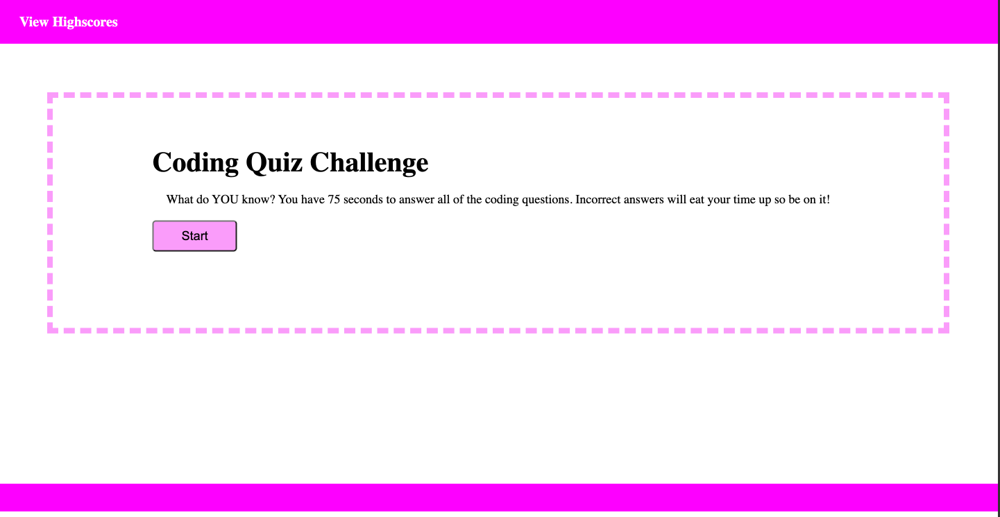

# code-quiz

## Description
This project was designed to help students test their JavaScript knowledge. It consists of a timed, 5 question multiple choice quiz and a highscore leaderboard that is stored locally.

## Preview

[Quiz yourself!](https://ashlynnwood.github.io/code-quiz/)

## Installation
N/A

## Usage
 Click the start button located in the middle of the page to begin the quiz. The timer will start and you will be presented with multiple choice questions. You have 75 seconds to complete the quiz, with the timer countdown displayed in the upper right. Choosing a wrong answer will deduct 10 seconds from the timer. Once all questions are complete, your score, which is equal to the time left, will be displayed. You can input your initials to save your score in the highscores list. You can begin the quiz again by clicking the go back button, which will bring you to the home page. You can also view the highscores list from the homepage by clicking on the view highscores link in the top left. Highscores can be reset by clicking the clear highscores button.

## Credits
N/A

## License
Please refer to the license in the repo.